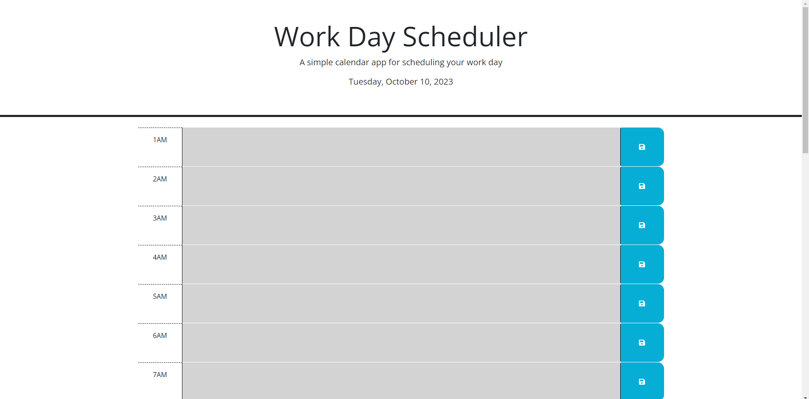

# DailyPlanner

## Description

This Web-Application allows for users to note down and schedule tasks for their day to day. It allows for not only working hours but ALL hours of the day.

An issues I had ran into was, calling every time-block by it's ID.

The solution to this was rather than calling every ID, I was able to use jQuery to automatically use the same ID that the user was editing.

## Usage
Gray - Past Hours

Red - Present Hour

Green - Future Hours

Select the text area and type in your notes.

**BE SURE** to click the **SAVE** icon after typing in your notes to ensure that they are saved.

## Links

Web-Application: https://cyrus212.github.io/DailyPlanner/

Github Repository: https://github.com/Cyrus212/DailyPlanner